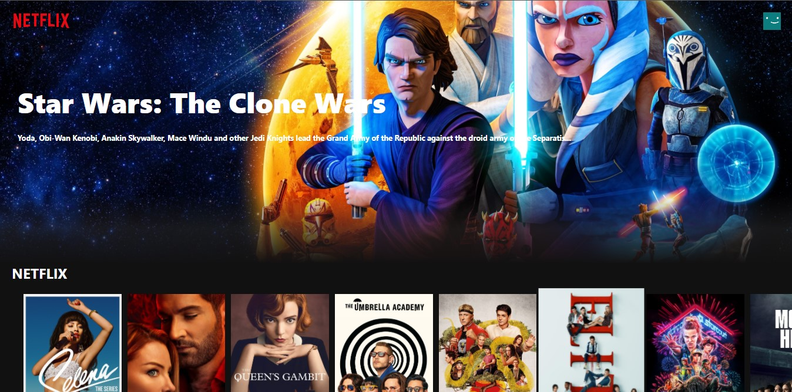
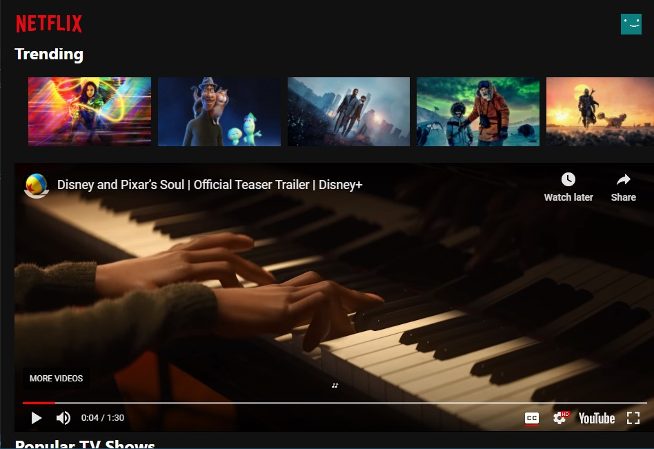

# Netflix Clone
This project is not the original Netflix. And was created for educational purposes.

## [Live Demo](https://netflix-clone-7ee9c.web.app/)
Check out the live demo @ [Netflix-clone demo.](https://netflix-clone-7ee9c.web.app/)

#

## About The Project
Netflix Clone a web app that queries [TMDb](https://developers.themoviedb.org/3/) api and displays trending movies and tv shows along with their respective trailers from YouTube. 



Trailers a played directly in the app itself. (as shown in the image below)



#

## Built With

Following are the major frameworks and libraries used to build this project.
* [ReactJS](https://reactjs.org/)
* [TMDb](https://developers.themoviedb.org/3/)

Following are some major node modules or packages used to build this project.
* [axios](https://www.npmjs.com/package/axios)
* [react-youtube](https://www.npmjs.com/package/react-youtube)

#

## What I have Learned.
Some of the new things that I have learned upon developing this project are as follows:
* React Hooks (obtainded understanding of the usage of useEffect).
* REST APIs (learned about endpoints and GET requests from the API using axios)
* Deployment to Firebase Hosting.

#

## Getting Started

To get a local copy up and running follow these simple example steps.

### Installation

1. Clone the repo
   ```sh
   git clone https://github.com/joseito-terence/netflix-clone.git
   ```
2. Install NPM packages
   ```sh
   npm install
   ```
3. Start NPM server.
   ```sh
   npm start
   ```